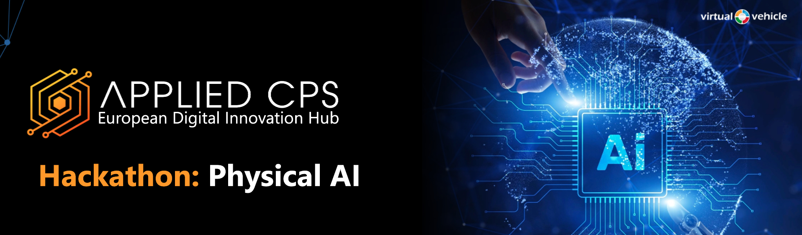

# 🤖 Physical AI Hackathon – Graz 2026




Build a controller, run it in Isaac Lab, and measure how well the **SO101 follower arm** tracks the leader.

This repository provides a complete simulation stack with **two environment entrypoints**:

- **Public teleoperation environment** – used by `scripts/train_rl.py` and `scripts/evaluate.py`
- **Internal kitchen `PickOrange` teleop environment** – used by `scripts/deploy/sim_pick_orange/teleop.py`

Both environments live under `so101_hackathon/envs/` and share the same SO101 follower robot.

---

## 📦 Quick Install

> ⚠️ **Requirements**: NVIDIA GPU (RTX 20xx or newer), Linux (Ubuntu 22.04/24.04 tested), ~30 GB free disk space.

### 1. Create a conda environment
```bash
conda create -n hack python=3.11 -y
conda activate hack
```

### 2. Install PyTorch
```bash
pip install --upgrade pip
pip install torch==2.7.0 torchvision==0.22.0 --index-url https://download.pytorch.org/whl/cu128
```

### 3. Install Isaac Sim and Isaac Lab

**Isaac Sim 5.1.0** (this will take several minutes):
```bash
sudo apt install cmake build-essential libglu1-mesa
pip install "isaacsim[all,extscache]==5.1.0" --extra-index-url https://pypi.nvidia.com
```

> 💡 **Verify Isaac Sim**: Run `isaacsim --headless` once to let it download additional assets. You can exit after the app is loaded successfully.

**Isaac Lab 2.3.0**:
```bash
cd path/to/so101_hackathon/ # You need to be inside the repo folder 
mkdir -p external
cd external
git clone https://github.com/isaac-sim/IsaacLab.git
cd IsaacLab
git checkout v2.3.0
./isaaclab.sh --install
```

### 4. Install this repository
```bash
cd ../..   # or replace with your actual '/path/to/so101_hackathon'
pip install -e .
```

The repo also requires `PyYAML`, `tqdm`, and `rsl-rl-lib==5.0.1` - they are installed automatically by `pip install -e .`.

---

## 🚀 Quick Start

This section walks you through the main workflows: simulation, rule‑based control, reinforcement learning, and real‑robot deployment.

### List available controllers
```bash
python scripts/list_controllers.py
```
This prints all registered controllers (e.g., `raw`, `pd`, `ppo`). You can add your own by editing `so101_hackathon/registry.py`.

---

### Simulate a controller (basic evaluation)

Run any controller in simulation and see how well the follower tracks a leader trajectory.

```bash
# Run the raw (passthrough) controller for 3 episodes, headless, with video
python scripts/evaluate.py --controller raw --headless --video
```

- `--headless` : no 3D viewer (faster for batch runs)
- `--num-episodes` : how many episodes to evaluate
- `--video` : record an MP4 of the follower’s behaviour

The recorded video is saved under `logs/raw/evaluation/<timestamp>/videos/`.

---

### Rule‑based controllers: PD baseline

The simplest working controller is a **proportional‑derivative (PD)** controller. It applies joint torques proportional to position error (`kp`) and velocity error (`kd`).

Run the PD baseline:
```bash
python scripts/evaluate.py --controller pd --headless --num-episodes 5 --video
```

Tune PD gains by editing `so101_hackathon/controllers/pd.py`.  

---

### AI‑based controllers: Reinforcement Learning

The RL baseline uses **PPO** to learn a *residual* correction on top of the leader command.  
The observation is the same robot state used during deployment; the action is a joint‑space residual added to the leader’s target.

#### Train a new policy
```bash
python scripts/train_rl.py --headless
```

Training logs and checkpoints are saved under `logs/rsl_rl/<experiment-name>/`.

#### Evaluate a trained checkpoint
```bash
python scripts/evaluate.py \
  --controller ppo \
  --checkpoint-path /full/path/to/model_1500.pt \
  --headless \
  --video
```

---

### Real robot deployment

Calibration files are saved under `~/.cache/huggingface/lerobot/calibration/`.

#### Calibrate the leader arm
```bash
python scripts/deploy/calibrate_hardware.py \
  --role leader \
  --port /dev/ttyACM1 \
  --id my_leader_arm
```

#### Calibrate the follower arm
```bash
python scripts/deploy/calibrate_hardware.py \
  --role follower \
  --port /dev/ttyACM0 \
  --id my_follower_arm
```

#### Deploy a controller in the PickOrange sim task

The internal `PickOrange` teleop environment allows you to test deployment logic in simulation before moving to hardware. It reads the SO101 leader arm, builds the flat controller observation used by the deployable controllers, and sends the adapted command to the simulated follower.

```bash
python scripts/deploy/sim_pick_orange/teleop.py \
  --controller raw \
  --teleop_device so101leader \
  --port /dev/ttyACM1 \
  --num_envs 1 \
  --device cuda \
  --enable_cameras
```

Key args:

- `--controller`: `raw`, `pd`, `ppo`
- `--checkpoint-path`: for learned controllers
- `--controller-coeff`: blend teleop vs controller
- `--num_envs`: parallel envs (use `1` for teleop)
- `--device`: `cuda` / `cpu`
- `--headless`: disable viewer

Hotkeys:
- `B` start  
- `R` reset  
- `N` success + reset  

For real hardware: `scripts/deploy/deploy.py`

---

## 📁 Outputs and Artifacts

### Evaluation runs save:

- `config.json` – hyperparameters used  
- `summary.json` – aggregated metrics  
- `tensorboard/` – logs for TensorBoard  
- `videos/` – when `--video` is enabled  

**Output locations**:

- `ppo` → nested under the training run:  
  `logs/rsl_rl/<experiment-name>/<train_run>/evaluation/<timestamp>/`
- Non‑RL controllers → `logs/<controller>/evaluation/<timestamp>/`

### Training logs go under:

`logs/rsl_rl/<experiment-name>/<timestamp>[_run-name]/`

---

## 🧑‍💻 Developer Workflow

1. Start from [`so101_hackathon/controllers/raw.py`](so101_hackathon/controllers/raw.py)  
2. Implement `act(obs) -> action`  
3. Register your controller in [`so101_hackathon/registry.py`](so101_hackathon/registry.py)  
4. Run evaluation and inspect the outputs  
5. Working, hmmm, let's beat the baseline 💪!
6. Not sure if you broke somethig or not? Run unit tests: `pytest`

**Built‑in baselines**:

| Controller | Description |
|------------|-------------|
| `raw` | Minimal pass‑through template |
| `pd` | Simple proportional‑derivative controller |
| `ppo` | Learned residual‑compensation baseline (RSL‑RL) |

---

## 📚 Repo Tour

| Path | Purpose |
|------|--------|
| [scripts/README.md](scripts/README.md) | General repo readme and Command-line entrypoints |
| [scripts/deploy/README.md](scripts/deploy/README.md) | Real-robot and deployment scripts |
| [so101_hackathon/controllers/README.md](so101_hackathon/controllers/README.md) | Controllers + baselines |
| [so101_hackathon/envs/README.md](so101_hackathon/envs/README.md) | Teleop environment entrypoints + helpers |
| [so101_hackathon/deploy/README.md](so101_hackathon/deploy/README.md) | Runtime and hardware integration helpers |
| [so101_hackathon/evaluation/README.md](so101_hackathon/evaluation/README.md) | Evaluation wrappers and metrics |
| [so101_hackathon/rl_training/README.md](so101_hackathon/rl_training/README.md) | PPO config and RSL-RL integration |
| [so101_hackathon/sim/README.md](so101_hackathon/sim/README.md) | Robot config, kinematics, simulator logic |
| [so101_hackathon/sim/robots/README.md](so101_hackathon/sim/robots/README.md) | Robot definitions and assets |
| [so101_hackathon/utils/README.md](so101_hackathon/utils/README.md) | General helpers |


---

## ❓ Troubleshooting

### `ModuleNotFoundError: No module named 'pkg_resources'` when running TensorBoard

Install or upgrade `setuptools`:
```bash
pip install --upgrade setuptools
# or pin to a compatible version:
pip install 'setuptools<81'
```

### Isaac Sim fails to start / Vulkan errors

- Ensure your NVIDIA driver is up‑to‑date (≥535 recommended).
- Try running `isaacsim --headless` without a display (for training/evaluation).
- If you have an integrated GPU, force Isaac Sim to use the discrete GPU:
  ```bash
  export VK_ICD_FILENAMES=/usr/share/vulkan/icd.d/nvidia_icd.json
  ```

### Leader arm not detected on `/dev/ttyACM*`

Add yourself to the `dialout` group and replug the USB:
```bash
sudo usermod -a -G dialout $USER
# then log out and back in
```

---

## 📄 License & Credits

This repository is part of the **Physical AI Hackathon Graz 2026**.  
Built on top of [Isaac Lab](https://github.com/isaac-sim/IsaacLab) and [LeRobot](https://github.com/huggingface/lerobot).
